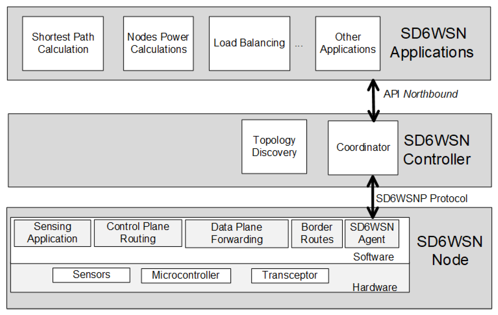

# Réseau Émergents

[**Articl SDN Architecture for 6LoWPAN Wireless Sensor Networks**](https://www.mdpi.com/1424-8220/18/11/3738/htm)

## Question 1:

Les motivations principales pour utiliser l’architecture SDN :
* __Agilité et flexibilité__ : améliore le contrôle du réseau et adapte rapidement aux changements aux besoins des entreprises. Le SDN facilite notamment la mise en place de nouveaux services.
* __Indépendance et innovation__ : Il permet aux fournisseurs du réseau d’être indépendants et y apporter leurs propres innovations.
* __Expansion vers IoT__ : Initialement utilisé pour les réseaux filaires, il se démocratise rapidement vers les réseaux sans fils afin de répondre aux besoins des objets connectés comme le réseau wifi des téléphones mobiles et le software-defined wireless sensor networks (SDWSN).

## Question 2:

* __Idée__ :

L’idée du SD6WSN est d’appliquer les principes du SDN au 6LoWPAN afin de supporter l’implémentation des applications réseaux complexes, ce que n’offre pas le protocole RPL (routing protocol for low power networks and losses) du 6LoWPAN.

De plus, 6LoWPAN utilise le protocole DODAG (destination oriented directed acyclic graph), ainsi que RPL. Cet algorithme n’élimine pas les boucles et dans le cas d’un goulot d’étranglement on observe plusieurs fragmentations des messages envoyés.

* __Choix du design & découverte du réseau__ :

